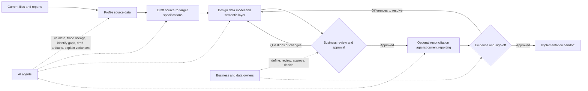

# Agentic Data Design: Adoption Pitch

## The Business Need

Business teams need trusted metrics, not another technical delivery exercise. Today, teams often spend significant time locating files, reconciling spreadsheets, clarifying definitions, and explaining why reports disagree. That delays decisions and makes delivery dependent on a small number of specialists.

This workflow uses AI agents to accelerate the evidence gathering, analysis, documentation, and comparison work around a governed data model and semantic layer. Business owners retain control of definitions, assumptions, approvals, and decisions.

## How the Workflow Operates

The output is a set of durable, reviewable assets: source-to-target specifications, a data model, a metric dictionary, design decisions, and, when required, a reconciliation plan. These assets are the controlled handoff to a separate delivery team.

## Why Adopt It

- **Faster clarity:** agents profile source data and organize evidence quickly, allowing teams to focus workshops on genuine decisions rather than file discovery.
- **More trusted metrics:** every key measure has an explicit definition, owner, source, grain, date logic, and reconciliation approach.
- **Lower delivery risk:** model decisions and assumptions are visible early, before they become expensive implementation rework.
- **Better continuity:** durable artifacts reduce reliance on individual analysts and make changes easier to assess, explain, and approve.
- **Stronger control:** agents can highlight inconsistencies and missing evidence, but business owners approve definitions and material conclusions.

## Compared With Common Delivery Approaches

| Approach | Typical Strength | Common Limitation for Data and Metrics | Agentic Data-Design Advantage |
| --- | --- | --- | --- |
| Waterfall without AI | Clear phases and formal sign-off | Evidence gathering and definition issues often surface late, after design documents have been handed over | Agents accelerate source analysis and keep lineage, decisions, and open questions visible before approval |
| Agile without AI | Iterative delivery and regular feedback | Teams can deliver increments quickly while metric definitions, reconciliation rules, and ownership remain fragmented | Each iteration produces governed model and metric artifacts, making feedback traceable and reusable |
| Agentic data design | Human-reviewed, evidence-led design | Requires clear ownership and disciplined approval | Combines rapid analysis with durable governance, without delegating business decisions to AI |

## What Changes for Stakeholders

Stakeholders contribute the business context that cannot be inferred from files: the meaning of a metric, its intended use, acceptable differences, materiality, ownership, and approval criteria. They review concise drafts and evidence rather than constructing technical specifications from scratch.

For a Treasury team, this means less time assembling and reconciling daily numbers, and more time deciding what a material movement means. For scenario analysis, it means faster exploration of approved assumptions while Treasury continues to own the assumptions and decisions.

## Adoption Path

Start with one reporting domain that has known manual effort or inconsistent metrics. Use the workflow to document the current state, profile representative extracts, design a small set of facts, dimensions, and priority measures, and reconcile them against the existing report. Approve the resulting artifacts before commissioning implementation.

Success is demonstrated when stakeholders can answer, for each priority metric: what it means, who owns it, where it comes from, how it is calculated, which time and grain rules apply, and how it compares with the current report.

## Governance Principle

AI agents support investigation and documentation. They do not become the system of record, select the authoritative metric definition, approve a model, or act on business conclusions. The approved semantic layer remains the shared source of truth.